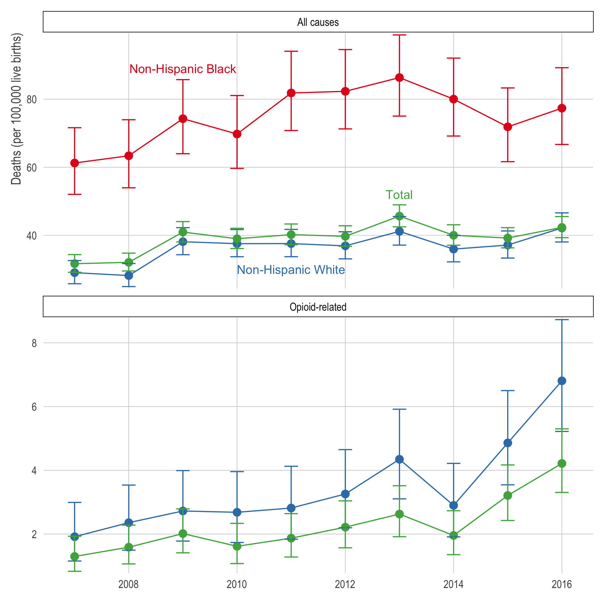

# `opioid-maternal`

# Introduction

Reproducible code for our paper [*"Trends in pregnancy-associated mortality involving opioids in the United States, 2007-2016"*](https://doi.org/10.1016/j.ajog.2018.09.028), which uses multiple cause of death data to examine trends in opioid mortality among pregnancy-related deaths. The citation is:

> Gemmill A, Kiang MV, and Alexander MJ. Trends in pregnancy-associated mortality involving opioids in the United States, 2007-2016. American Journal of Obstetrics and Gynecology. Published ahead-of-print (September 2018). [doi: 10.1016/j.ajog.2018.09.028](https://doi.org/10.1016/j.ajog.2018.09.028)

```{r echo=FALSE, fig.align='center', out.width=550}

```

## Issues
Please submit issues [via Github](https://github.com/MJAlexander/opioid-maternal/issues).

# Requirements
## Restricted-access data

This analysis uses [restricted-access multiple cause of death (MCOD) data](https://www.cdc.gov/nchs/nvss/dvs_data_release.htm), with geographic identifiers, from the [National Center for Health Statistics](https://www.cdc.gov/nchs/data_access/restrictions.htm). Therefore, in order to reproduce the entire pipeline (i.e., go from raw data to Figure 1), you must have access to these files. Access to the raw data can be requested through [NAPHSIS](https://www.naphsis.org/). 

If you have the restricted-access data, you must specify the location of each file (i.e., year) in the `00b_process_raw_files.R` file (starting at line 19) or create a folder called `./restricted_data` with the files in their original name. 

## Software
We use [`R`](https://cran.r-project.org/) and highly recommend the use of RStudio when running `R`. RStudio can be [downloaded here](https://www.rstudio.com/products/rstudio/download/).

## `R` Packages
To run this code, you'll need the following `R` packages from CRAN:

- `tidyverse`
- `here`.

In addition, you'll need our package for working with multiple cause of death data, [`narcan`](https://github.com/mkiang/narcan). 

If you would like to reproduce the full pipeline, including the raw data, you should also install the following packages: 

- `doParallel`
- `foreach`
- `config`
- `yaml`

# Analysis pipeline

This pipeline is divided into two parts. The first part requires restricted-access MCOD data and consists of the code files beginning with `00`. The second part uses shareable (i.e., $N \ge 10$ deaths) data generated from the `00` files to create the Figure shown in the letter. This file begins with `01` and can be run without access to the restricted data. **All files are made to be run in alphanumeric order.**

If you have restricted-access files, specify the file locations in `00b_process_raw_files.R` and the entire pipeline will run. If you do not have restricted-access files, simply run the pipeline starting at `01a_generate_figure1.R`.

The result of this pipeline is Figure 1 of the letter (in `./figs`) and the data required to generate it (`./working_data_2007_2016.csv`). These data adhere to the NCHS data use agreement and omit any observation with fewer than 10 deaths (see Line 158 of the `00c` file).

In addition, there are two supplemental files. `99_generate_checkbox_years_table.R` is a simple script that creates a table of states and the year that state implemented the checkbox. Data come from various sources — check the code for details. `mk_nytimes.R` is just a plotting theme used for Figure 1.

# Session Information

Both `devtools::session_info()` and `sessionInfo()` output can be found in the `./session_info.txt` file. This output provides exact version information for each package we used, `R`, and our operating system.

```{r echo=TRUE, message=FALSE, warning=FALSE, eval=FALSE}
sink("./session_info.txt", append = FALSE, split = FALSE)
cat(sprintf("Date/Time of Info: %s\n", Sys.time()))

cat("\n\ndevtools::session_info()\n")
devtools::session_info()

cat("\n\n\nsessionInfo()\n")
sessionInfo()
sink()
```

# Authors
- [Monica Alexander](http://monicaalexander.com) (: [MJAlexander](https://github.com/MJAlexander) | : [\@monjalexander](https://twitter.com/monjalexander))
- [Alison Gemmill](NEED LINK) (: [agemmill](https://github.com/agemmill) | : [\@alisongemmill](https://twitter.com/alisongemmill))
- [Mathew Kiang](https://mathewkiang.com) (: [mkiang](https://github.com/mkiang) | : [\@mathewkiang](https://twitter.com/mathewkiang))
